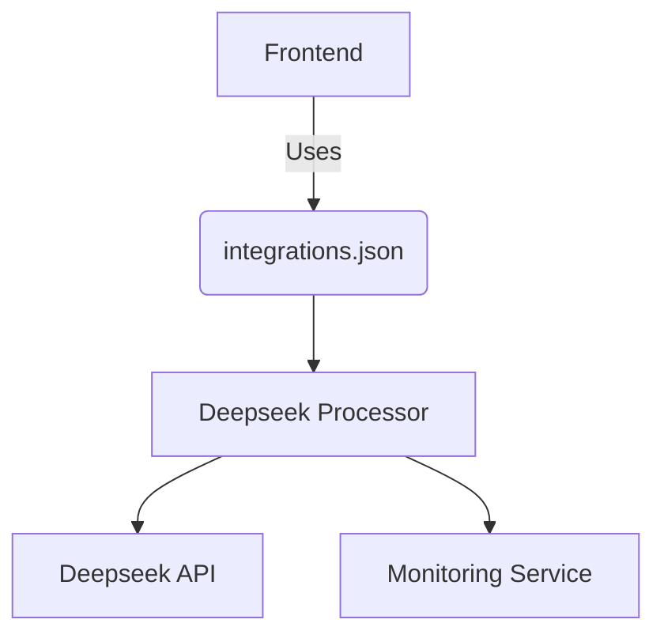

# Deepseek Integration Guide

## Architecture Overview

## Configuration

- Defined in `integrations.json` under `DEEPSEEK` section
- Features:
  - Reply suggestions
  - Summarization
  - Structured prompt templates
- Requires API key configuration

## Implementation Details

| Aspect          | Deepseek                        |
|-----------------|---------------------------------|
| Base Service    | `deepseek_base_service.rb`      |
| Processor       | `processor_service.rb`          |
| Prompts         | Separate `.txt` files           |
| Monitoring      | Dedicated `monitoring.rb`       |

## Prompt Handling

- Uses template files:
  - `reply.txt`
  - `summary.txt`
- Structured approach for consistent results

## Monitoring

- Dedicated monitoring service
- Detailed logging
- Performance metrics
- Error tracking and alerts